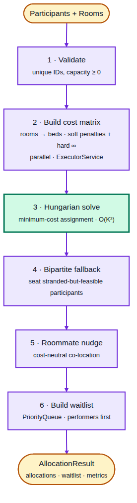
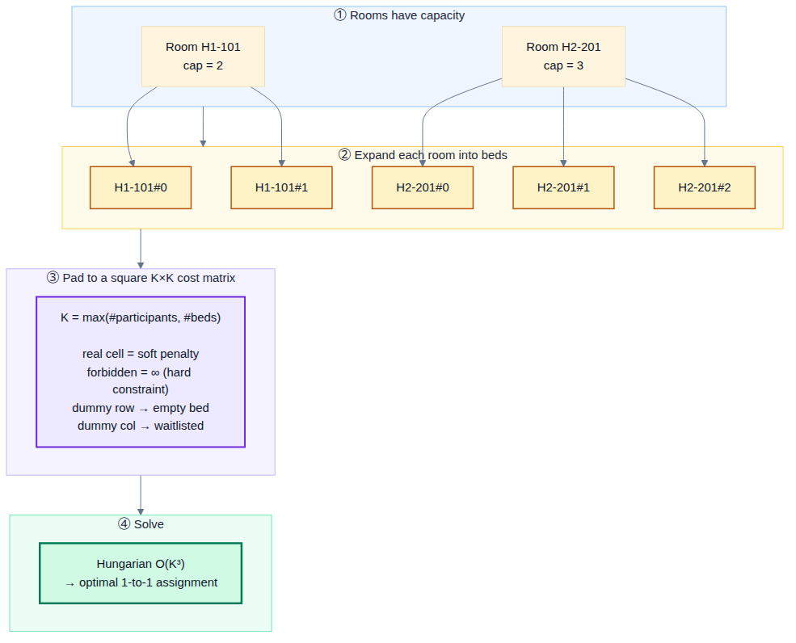
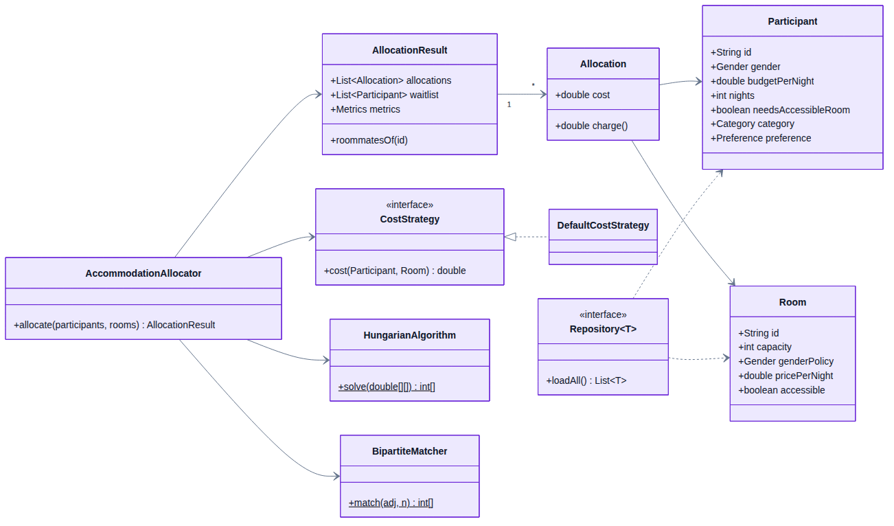
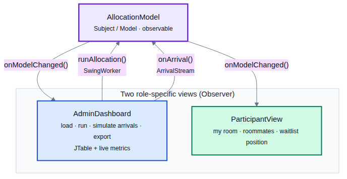

# Diagrams — Accommodation Allocation Engine

Each diagram below is provided three ways:

- a **rendered PNG** (embedded here; drop into the report/Word),
- a **rendered SVG** in `diagrams/` (used by `slides.md`; scales without blur),
- the **styled Mermaid source** `diagrams/NN-name.mmd` (edit + re-render).

**Re-render** (uses the system Chrome; produces both formats):

```bash
cd diagrams
npx -y @mermaid-js/mermaid-cli -i 01-integration.mmd -o 01-integration.svg -b white
npx -y @mermaid-js/mermaid-cli -i 01-integration.mmd -o 01-integration.png -b white -w 1500
```

A `puppeteer.json` with `{"executablePath":"/usr/bin/google-chrome","args":["--no-sandbox"]}`
may be needed via `-p puppeteer.json` on Linux.

---

## 1. Integration / data flow

How the engine plugs into the festival platform (Accommodation → engine → Wallet / Mobile /
Admin), plus the simulated real-time arrival stream.


---

## 2. Allocation pipeline

The six stages every run goes through, with the Hungarian solve highlighted.



---

## 3. The modelling trick (capacity → beds → square matrix)

How a many-to-one, unequal-size problem becomes a square assignment the Hungarian algorithm
solves exactly.



---

## 4. Software architecture

Packages and how the entry points (CLI, GUI) flow through the service into the algorithm, cost,
IO and concurrency layers.


---

## 5. UML class diagram (core)



---

## 6. GUI — two roles (MVC + Observer)

One shared observable model; an Admin dashboard and a Participant view both observe it.


