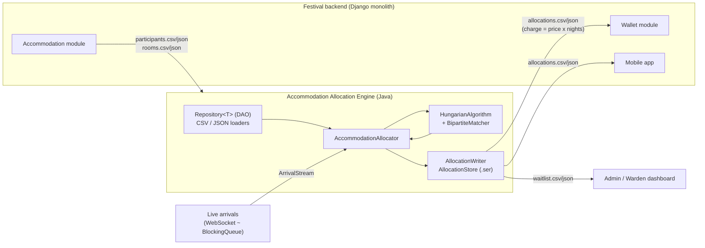
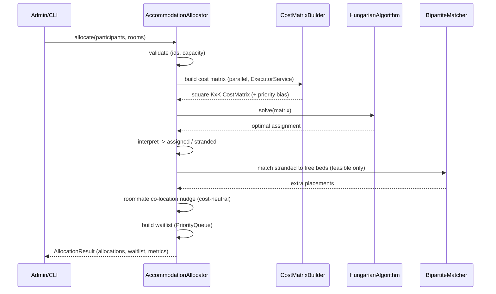
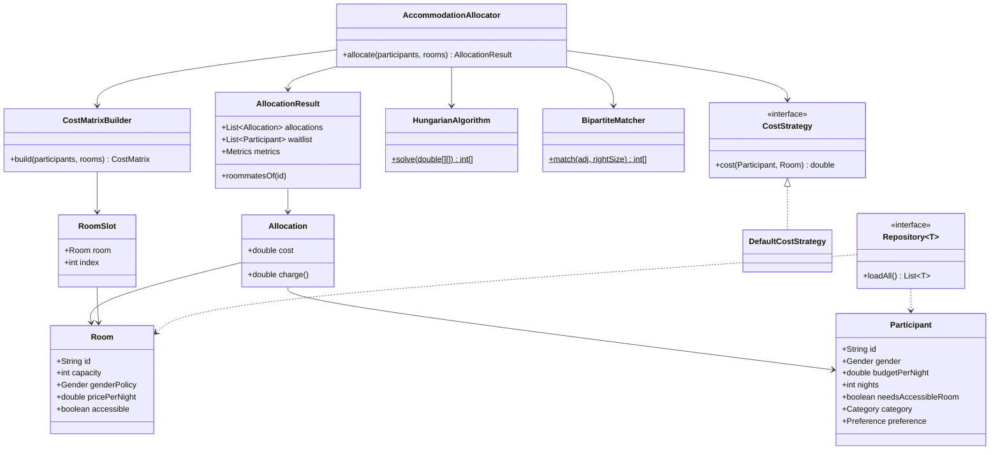
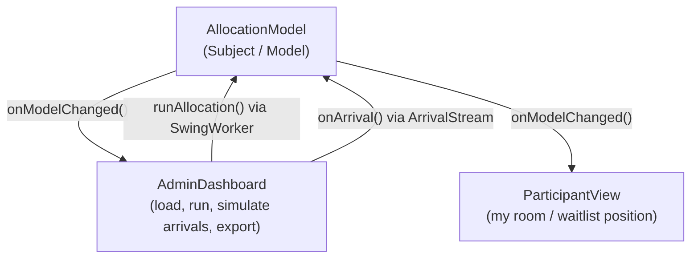

# Diagrams — Accommodation Allocation Engine

Render these with any Mermaid-capable viewer (GitHub, VS Code Markdown Preview Mermaid
extension, or <https://mermaid.live>). Export to PNG/SVG for the report/slides.

---

## A. Data-flow / integration diagram

---

## B. Allocation pipeline (sequence)

---

## C. UML class diagram (core)

---

## D. GUI roles (Observer / MVC)

