# Accommodation Allocation Engine
### Optimal hostel-room assignment for the cultural festival

**Part A — Problem Formulation**
Track 1 · Mathematical Models for Operations
_Proposed approach: Hungarian (Kuhn–Munkres) algorithm + bipartite matching_

**Group 7** · OOP Summer 2026 · BITS Pilani
_Members: Atharv (2024A7UB0206P), Aarav (2024A7UB0205P)_

---

## 1 · The problem

The festival serves **5,000–6,000 users**. Many are **outstation participants** who need a hostel
bed for a few nights, and rooms are a **scarce, constrained resource** — each has a fixed
capacity, a gender policy, a price, and may or may not be accessibility-equipped.

Today the warden allocates rooms **by hand on a spreadsheet**. At this scale that causes:

- **Gender / accessibility mistakes** — someone placed in an incompatible room.
- **Ignored preferences** — building, room type, roommates.
- **Wasted beds** sitting empty while other rooms are oversubscribed.
- An **ad-hoc, unfair waitlist** when demand exceeds supply.

> **The need:** an automated tool that computes a room assignment which **minimises total
> dissatisfaction**, **never violates a hard constraint**, and produces a **fair waitlist**.

---

## 2 · Our idea in one slide

We will **model accommodation as the classic *assignment problem*** and solve it with an exact
algorithm rather than manual heuristics.

- Treat each **bed** as a slot and each **participant** as something to assign to a slot.
- Score every (participant, room) pairing: **hard rules** (gender, accessibility) are *forbidden*;
  **soft preferences** (budget, building, room type, roommates) add a *penalty*.
- Find the assignment with the **minimum total penalty** using the **Hungarian algorithm** — the
  textbook exact, optimal method for assignment.
- Whoever can't be seated goes onto a **priority-ordered waitlist**.

This turns a chaotic manual chore into a reproducible, provably-optimal computation that plugs into the existing platform.

---

## 3 · Inputs & outputs

**Planned inputs** (exported by the Accommodation module as CSV / JSON):

- **Participants** — id, gender, budget/night, nights, arrival day, accessibility need,
  **category** (Performer / VIP / Delegate / Attendee), preferences (building, room type, roommates).
- **Rooms** — id, building, floor, **capacity**, **gender policy**, price/night, accessible?, type.

**Planned outputs** (re-imported by the platform):

- **`allocations`** — who stays in which room, plus the **wallet charge** = price × nights.
- **`waitlist`** — everyone unplaced, ordered by priority.
- **`metrics`** — placement rate, dissatisfaction, utilisation.

CSV/JSON keeps the tool aligned with the platform's file-exchange and REST payloads.

---

## 4 · Proposed mathematical model

Assign participants $P$ to **beds** $B$ (a room of capacity *k* contributes *k* beds), minimising
total cost:

$$\min \sum_{i \in P}\sum_{j \in B} c_{ij}\,x_{ij}\qquad \text{s.t. } \textstyle\sum_j x_{ij}\le 1,\ \sum_i x_{ij}\le 1,\ x_{ij}\in\{0,1\}$$

- $c_{ij}=\infty$ → **hard constraint** (gender policy or accessibility) — a *forbidden* pairing.
- otherwise $c_{ij}$ = sum of **soft penalties**: budget overflow + building / room-type mismatch.

We will pad the costs to a **square $K\times K$ matrix** ($K=\max(|P|,|B|)$) with zero-cost dummy
rows/columns, then solve it **exactly with the Hungarian algorithm, $O(K^3)$**. A participant
matched to a dummy column is **waitlisted**.

---

<!-- _class: diagram -->
## 5 · Modelling approach — capacity → beds → square matrix

Key idea: expand rooms into interchangeable beds and pad to a square matrix, so the exact Hungarian algorithm applies. Empty beds and the waitlist both fall out naturally from the dummy padding.

---

## 6 · Proposed solution approach

We plan a clear **optimise → repair → finalise** pipeline:

1. **Validate** the input (unique IDs, sane capacities).
2. **Build the cost matrix** — score every (participant, bed) pair (computed concurrently).
3. **Hungarian solve** — the globally optimal minimum-cost assignment.
4. **Bipartite-matching fallback** — re-seat anyone the optimum stranded into beds left free.
5. **Roommate co-location** — a light, cost-neutral improvement pass.
6. **Build the waitlist** — order the overflow by priority.

Each later stage only improves the result; none can break a hard constraint or worsen total dissatisfaction.

---

<!-- _class: diagram -->
## 7 · Proposed pipeline

The Hungarian solve (green) is the exact optimiser; the surrounding stages prepare the data and refine the result.

---

## 8 · Innovation — why this is more than a textbook solve

- **Capacity via bed-expansion + dummy padding** — turns a messy many-to-one, unequal-size problem
  into a *clean square assignment* that can be solved **exactly**, not heuristically.
- **Priority as a matrix-only bias** — decide *who* wins a scarce bed (performers first) **without**
  distorting which room a seated person gets.
- **Optimise-then-repair** — combine an exact optimiser with a feasibility-recovery matching pass.
- **Real-time ready** — plan a streaming intake so **late registrations** can be allocated live,
  mirroring the platform's WebSocket feed.

---

## 9 · Planned integration with the platform

The tool will reuse the platform's existing **file-exchange** channel — Django can produce the
inputs and consume the outputs unchanged:

- **In** ← Accommodation module: `participants.*`, `rooms.*`.
- **Out** → **Wallet**: `allocations.*` with `charge = price × nights` to debit each wallet.
- **Out** → **Mobile app**: `allocations.*` to notify "your room is H1-101".
- **Out** → **Admin**: `waitlist.*` for follow-up / re-allocation.
- **Real-time** → a simulated arrival stream mimics the WebSocket feed for live re-allocation.

---

<!-- _class: diagram -->
## 10 · Integration / data flow (planned)

The engine sits between the Accommodation module (inputs) and the Wallet / Mobile / Admin consumers (outputs), with a live arrival stream feeding it.

---

## 11 · Java features we will use (and why)

| Feature | Planned use in this project |
|---|---|
| **Generics** | a type-safe `Repository<T>` data loader and a pluggable `CostStrategy` |
| **Concurrency** | a thread pool to build the cost matrix; a queue-based live arrival stream |
| **Collections** | a `PriorityQueue` for the waitlist; maps/sets throughout |
| **Serialization** | save an allocation snapshot for offline cache / resume |
| **File I/O** | read/write CSV and JSON for platform integration |
| **Custom exceptions** | clear errors for invalid / infeasible / unreadable input |
| **Design patterns** | Strategy, Factory, DAO, Observer/MVC, Singleton, Producer–Consumer |

Comfortably satisfies the "justify ≥ 2 advanced features" requirement — each maps to a concrete need.

---

## 12 · Success metrics (how we'll judge it)

| Metric | Target |
|---|---|
| Hard-constraint violations | **zero** (gender / accessibility never broken) |
| Placement rate | as high as capacity allows (100 % when beds ≥ demand) |
| Total / average dissatisfaction | minimised — the global optimum |
| Bed utilisation | maximised (few empty beds) |
| Runtime for a few hundred participants | well under a second |
| Waitlist fairness | deterministic order: category → arrival day → ID |

---

## 13 · Feasibility & scope (2–3 weeks)

Self-contained, no server required; will run from sample data:

- **Week 1** — domain model, Hungarian core, cost model, unit tests.
- **Week 2** — CSV/JSON I/O, allocation orchestration, waitlist, serialization, CLI.
- **Week 3** — Swing GUI (separate Admin & Participant views), arrival stream, demo + report.

**Planned deliverables (Part B):** documented Java implementation · unit tests · CLI + two-role
GUI · integration via sample CSV/JSON files · demo video.

---

# Thank you

**Accommodation Allocation Engine — Problem Formulation**
A proposal to make festival room allocation **optimal, fair and constraint-safe**, integrated
with the Wallet, Mobile and Accommodation modules.

**Group 7** — Atharv (2024A7UB0206P), Aarav (2024A7UB0205P)

_Questions?_
