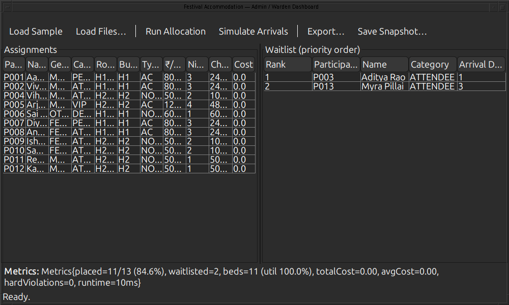
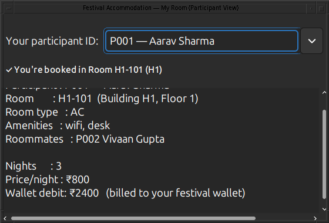

# Accommodation Allocation Engine — Part B (Solution)

Festival Management Platform · Track 1 (Mathematical Models for Operations)

A standalone Java component that assigns outstation festival participants to hostel rooms by
modelling the problem as a **minimum-cost assignment** and solving it with the
**Hungarian (Kuhn–Munkres) algorithm**, with a **maximum-bipartite-matching** feasibility
fallback. It minimises total participant *dissatisfaction* subject to hard constraints
(gender policy, accessibility, capacity, budget), seats higher-priority categories first when
beds are scarce, produces a prioritised waitlist, and exchanges data with the festival's
**Accommodation → Wallet / Mobile** modules through CSV/JSON files.

---

## 1. Quick start

> Requires a **JDK 17+** (`javac`). The scripts auto-detect `JAVA_HOME`, a `javac` on `PATH`,
> common install dirs, or a JDK bundled with the VS Code Java extension. The two dependency
> jars are already in `lib/` (`gson.jar`, `junit-platform-console-standalone.jar`).

```bash
cd PartB_Solution

./compile.sh            # compile all sources -> out/   (Java 17 bytecode)
./run-cli.sh            # run the bundled sample (data/participants.csv + data/rooms.csv)
./run-gui.sh            # launch the Swing GUI (role chooser: Admin / Participant)
./test.sh               # compile + run the JUnit 5 suite (37 tests)
```

Custom input / output:

```bash
./run-cli.sh data/participants.json data/rooms.json out_dir --format json
```

Windows (PowerShell / cmd) equivalent of `compile.sh` + `run-cli.sh`:

```bat
javac --release 17 -d out -cp lib\gson.jar (Get-ChildItem -Recurse src\main -Filter *.java).FullName
java -cp "out;lib\gson.jar" com.bits.festival.accommodation.cli.Main data\participants.csv data\rooms.csv out_data --format csv
```

### Screenshots

**Admin / Warden dashboard** — live assignments, prioritised waitlist, success metrics:



**Participant view** — "my room", roommates, and the wallet charge:



---

## 2. What it does (problem → outputs)

| | |
|---|---|
| **Inputs**  | `participants.(csv\|json)` and `rooms.(csv\|json)` |
| **Model**   | bipartite assignment of participants → room *beds*; cost = weighted soft-preference penalties; hard constraints = forbidden edges |
| **Solver**  | Hungarian O(K³) for the optimum + Kuhn bipartite matching to recover stranded-but-feasible placements |
| **Outputs** | `allocations.(csv\|json)` (incl. **wallet charge** = price × nights), `waitlist.(csv\|json)`, `allocation.ser` (serialized snapshot) |
| **Metrics** | placement rate, total/avg dissatisfaction, **hard-constraint violations (always 0)**, bed utilisation, runtime |

Measured performance (matrix build + Hungarian + fallback + roommate nudge): **N=500 ≈ 0.23 s,
N=800 ≈ 0.6 s** on a commodity laptop, 100 % placement when capacity allows, 0 violations.

---

## 3. Architecture

```
cli/Main ─┐                                   gui/AppLauncher ── AdminDashboard / ParticipantView
          │                                          │                    (MVC + Observer, SwingWorker)
          ▼                                          ▼
                       service/AccommodationAllocator
   validate → build cost matrix → Hungarian solve → bipartite fallback → roommate nudge → waitlist
          │                 │                 │                 │
   io/Repository<T>   cost/CostStrategy   algorithm/Hungarian   algorithm/BipartiteMatcher
   (DAO: CSV/JSON)    (Strategy+Factory)  algorithm/CostMatrixBuilder (ExecutorService)
          │
   io/AllocationWriter (CSV/JSON)   io/AllocationStore (serialization)
          │
   concurrent/ArrivalStream  (BlockingQueue Producer–Consumer — simulated real-time feed)
```

Package map (under `com.bits.festival.accommodation`):

- **`model`** — immutable domain objects (`Participant`, `Room`, `RoomSlot`, `Allocation`,
  `AllocationResult`, `Metrics`, `Gender`, `Preference`); all `Serializable`.
- **`cost`** — `CostStrategy` (Strategy), `DefaultCostStrategy`, `CostStrategyFactory`
  (Factory), `AllocationConfig` (thread-safe Singleton of tunable weights).
- **`algorithm`** — `HungarianAlgorithm` (Kuhn–Munkres), `CostMatrixBuilder`
  (parallel matrix build via `ExecutorService`), `BipartiteMatcher` (Kuhn augmenting paths),
  `CostMatrix`.
- **`service`** — `AccommodationAllocator` (orchestration + waitlist + roommate local search).
- **`io`** — `Repository<T>` DAO with CSV/JSON implementations, `RepositoryFactory`,
  `AllocationWriter`, `AllocationStore`, `CsvUtil`.
- **`concurrent`** — `ArrivalStream` (Producer–Consumer over a `BlockingQueue`).
- **`exception`** — checked hierarchy: `AccommodationException` → `InvalidInputException`,
  `DataLoadException`, `InfeasibleAllocationException`.
- **`cli`** / **`gui`** — entry points.

---

## 4. Advanced Java features (rubric mapping)

| Feature | Where |
|---|---|
| **Collections framework** | `PriorityQueue` (waitlist), `TreeMap`/`HashMap`/`EnumMap`, `Set` amenities, `CopyOnWriteArrayList` listeners |
| **Generics** | `Repository<T>`, `CostStrategy`, generic table models |
| **Concurrency** | `ExecutorService` (parallel cost-matrix build), `SwingWorker` (non-blocking GUI), `BlockingQueue` Producer–Consumer arrival stream, `synchronized` model |
| **Custom exceptions** | `exception/*` checked hierarchy |
| **File I/O** | `BufferedReader/Writer`, `Files`, try-with-resources (CSV); Gson (JSON) |
| **Serialization** | `AllocationStore` (`ObjectOutputStream`/`ObjectInputStream`) |
| **Lambdas / functional interfaces** | comparators (`WAITLIST_ORDER`), `Runnable`, `Consumer`, streams |
| **Inner / nested classes** | table models, DTOs, builders, Singleton holder |
| **Design patterns** | Strategy, Factory, DAO/Repository, Observer, MVC, Singleton, Builder, Producer–Consumer |
| **Algorithms / DS** | Hungarian O(n³), Kuhn bipartite matching, slot-expansion modelling |

---

## 5. Integration with the festival platform (data contracts)

The component speaks the festival's existing **file-exchange** channel — the Django backend can
produce the inputs and consume the outputs unchanged.

**`participants.csv`** header (JSON uses the same field names):
```
id,name,gender,homeCity,budgetPerNight,arrivalDay,nights,needsAccessible,category,prefBuilding,prefRoomType,prefRoommates
```
- `gender`: `MALE|FEMALE|OTHER`  · `category`: `PERFORMER|VIP|DELEGATE|ATTENDEE`
- `prefRoommates`: `;`-separated participant IDs.

**`rooms.csv`** header:
```
id,building,floor,capacity,genderPolicy,pricePerNight,accessible,roomType,amenities
```
- `genderPolicy`: `MALE|FEMALE|ANY`  · `amenities`: `;`-separated.

**`allocations.csv`** (→ Wallet billing & Mobile notifications):
```
participantId,participantName,roomId,building,roomType,nights,pricePerNight,charge,dissatisfaction
```
`charge = pricePerNight × nights` is the amount the **Wallet module** debits.

**`waitlist.csv`** (→ admin / re-allocation):
```
waitlistRank,participantId,participantName,category,arrivalDay
```

Other integration channels are demonstrated too: `ArrivalStream` simulates the **WebSocket/
Firebase** real-time arrival feed via a `BlockingQueue`, and `allocation.ser` is the offline
**resume/cache** snapshot.

---

## 6. Modelling notes & assumptions

- A room of capacity *k* is expanded into *k* identical **beds (slots)**; the square cost matrix
  is padded with zero-cost dummy rows/cols (`K = max(participants, beds)`). A participant matched
  to a dummy column is **waitlisted**.
- **Hard constraints** (gender policy, accessibility) are forbidden edges, represented by a large
  finite sentinel so the solver stays numerically stable; any real pairing left on a sentinel
  cell is moved to the waitlist (never reported as a violation).
- **Priority**: a constant per-participant bias (category rank) is added *inside the solver matrix
  only*, so scarce beds go to higher-priority categories first **without** distorting which room a
  seated participant receives or the reported dissatisfaction.
- **Roommate grouping** is a soft preference handled by a bounded local search (move into a
  roommate's room if a bed is free, else swap) that only ever applies cost-neutral, feasibility-
  preserving improvements.

---

## 7. Tests

`./test.sh` runs 37 JUnit 5 tests covering the Hungarian core (known optima, ties, validation),
the bipartite matcher, the cost model (hard/soft), the full allocator (feasible / waitlist /
accessibility / duplicates / infeasible / roommate co-location), CSV+JSON loading and malformed
input, serialization round-trip, and the Producer–Consumer arrival stream.
