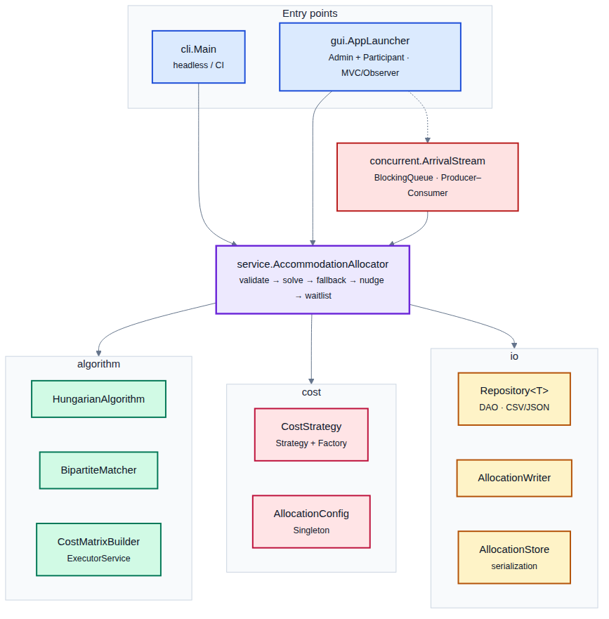
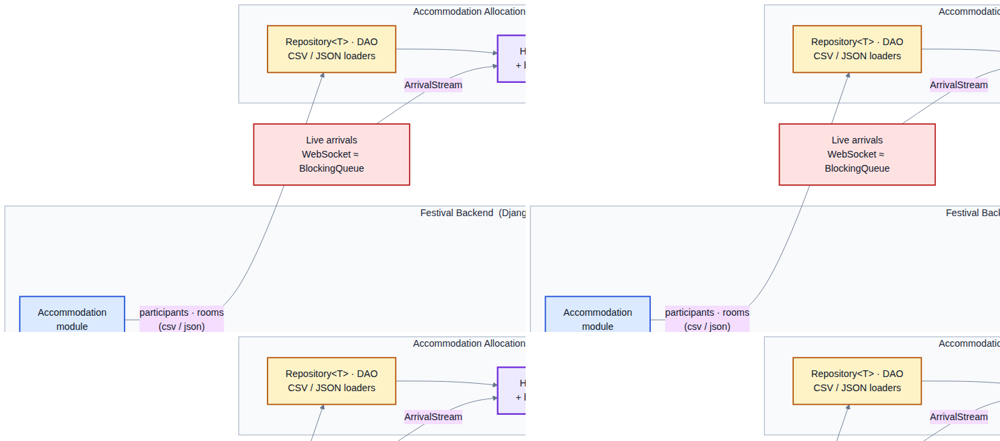

# Accommodation Allocation Engine — User & Developer Manual

**Festival Management Platform · Track 1 (Mathematical Models for Operations)**
OOP Summer 2026 · BITS Pilani

A standalone Java component that assigns outstation festival participants to hostel rooms by
modelling the task as a **minimum-cost assignment problem** and solving it with the **Hungarian
(Kuhn–Munkres) algorithm**, with a **maximum-bipartite-matching** feasibility fallback. It
minimises total participant *dissatisfaction* while never breaking a hard constraint (gender
policy, accessibility, capacity), seats higher-priority categories first when beds are scarce,
produces a fair waitlist, and exchanges data with the festival's **Accommodation → Wallet /
Mobile** modules through CSV/JSON files.

This document is a complete manual: it explains what the program does, how to install and run
it, every file format, how the algorithm works (with a worked example), the full architecture,
how to configure and extend it, how to test it, and how to demo it.

---

## Table of contents

1. [What this program does](#1-what-this-program-does)
2. [Key concepts & glossary](#2-key-concepts--glossary)
3. [Prerequisites](#3-prerequisites)
4. [Project layout](#4-project-layout)
5. [Quick start](#5-quick-start)
6. [Using the CLI](#6-using-the-cli)
7. [Using the GUI](#7-using-the-gui)
8. [Input file formats](#8-input-file-formats)
9. [Output file formats](#9-output-file-formats)
10. [How the algorithm works (worked example)](#10-how-the-algorithm-works-worked-example)
11. [The cost model & tuning](#11-the-cost-model--tuning)
12. [Architecture & package guide](#12-architecture--package-guide)
13. [Design patterns used](#13-design-patterns-used)
14. [Advanced Java features (rubric mapping)](#14-advanced-java-features-rubric-mapping)
15. [Integration with the festival platform](#15-integration-with-the-festival-platform)
16. [Extending the system](#16-extending-the-system)
17. [Testing](#17-testing)
18. [Performance](#18-performance)
19. [Troubleshooting & FAQ](#19-troubleshooting--faq)
20. [Assumptions & limitations](#20-assumptions--limitations)
21. [Demo video walkthrough](#21-demo-video-walkthrough)

---

## 1. What this program does

The festival serves 5,000–6,000 users; many are **outstation participants** who need a hostel
bed for a few nights. Rooms are scarce and constrained — each has a fixed **capacity**, a
**gender policy**, a **price**, and may or may not be **accessibility-equipped**. Doing this by
hand causes clashes, accessibility/gender mistakes, ignored preferences, wasted beds and an
unfair waitlist.

This engine takes a list of **participants** and a list of **rooms** and produces:

- an **allocation** — who sleeps in which room — that is **provably optimal** (lowest total
  dissatisfaction) and **never violates a hard constraint**;
- a **waitlist** of anyone who couldn't be placed, ordered fairly (performers first, then
  earlier arrivals);
- **metrics** (placement rate, dissatisfaction, utilisation, runtime);
- a per-participant **wallet charge** (`price/night × nights`) for the billing module.

It runs head-less from the **command line**, interactively through a **Swing GUI** (with separate
Admin and Participant views), and integrates with the backend purely through **files**.

---

## 2. Key concepts & glossary

| Term | Meaning |
|------|---------|
| **Assignment problem** | Classic optimisation: match each worker to one task minimising total cost. Here "workers" = participants, "tasks" = beds. |
| **Hungarian / Kuhn–Munkres algorithm** | An exact O(n³) algorithm that solves the assignment problem optimally. The mathematical core of this project. |
| **Bed / slot** | One sleeping place. A room of capacity *k* provides *k* beds. The model assigns participants to beds, not rooms. |
| **Cost / dissatisfaction** | A number ≥ 0 for placing a participant in a room. `0` = perfect; higher = worse. The engine minimises the total. |
| **Hard constraint** | A rule that must never be broken (gender policy, accessibility). Modelled as a forbidden pairing (∞ cost). |
| **Soft preference** | A "nice to have" (preferred building, room type, budget, roommates). Missing it adds a penalty but is allowed. |
| **Dummy row / column** | Padding added to make the cost matrix square. A participant matched to a dummy column is **waitlisted**; a dummy row matched to a real bed leaves that bed **empty**. |
| **Category** | Participant priority: `PERFORMER` > `VIP` > `DELEGATE` > `ATTENDEE`. Decides who wins a scarce bed. |
| **Waitlist** | Ordered list of participants who could not be seated. |

---

## 3. Prerequisites

- **JDK 17 or newer** (the code targets Java 17 bytecode; it compiles and runs on 17, 21, …).
  Verify with `java -version` and `javac -version`.
- A POSIX shell (Linux/macOS) for the `*.sh` scripts. Windows users: see the manual commands in
  [§5](#5-quick-start).
- The two dependency JARs are **already bundled** in `lib/`:
  - `gson.jar` — JSON parsing/writing (optional; CSV works without it).
  - `junit-platform-console-standalone.jar` — runs the test suite.

> **JDK auto-detection.** The scripts look for `javac` in this order: `$JAVA_HOME`, then `PATH`,
> then common install directories, then a JDK bundled with the VS Code Java extension. If none is
> found, set `JAVA_HOME` to your JDK and re-run. No system JDK? Any JDK 17+ folder works.

---

## 4. Project layout

```
PartB_Solution/
├── README.md            ← this manual
├── compile.sh           ← build all sources into out/
├── run-cli.sh           ← run the headless allocator
├── run-gui.sh           ← launch the Swing GUI
├── test.sh              ← compile + run JUnit 5 tests
├── _env.sh              ← shared JDK/classpath detection (sourced by the others)
├── lib/                 ← gson.jar, junit-platform-console-standalone.jar
├── data/                ← sample inputs: participants.{csv,json}, rooms.{csv,json}
├── docs/                ← screenshots used in this README
├── out/                 ← compiled .class files (generated; git-ignored)
└── src/
    ├── main/java/com/bits/festival/accommodation/
    │   ├── model/       domain objects (Participant, Room, RoomSlot, Allocation, …)
    │   ├── cost/        CostStrategy, DefaultCostStrategy, Factory, AllocationConfig
    │   ├── algorithm/   HungarianAlgorithm, CostMatrixBuilder, BipartiteMatcher, CostMatrix
    │   ├── service/     AccommodationAllocator (orchestration)
    │   ├── io/          Repository DAO (CSV/JSON), AllocationWriter, AllocationStore, CsvUtil
    │   ├── concurrent/  ArrivalStream (BlockingQueue Producer–Consumer)
    │   ├── exception/   checked exception hierarchy
    │   ├── cli/         Main (command-line entry point)
    │   └── gui/         AppLauncher, AdminDashboard, ParticipantView, AllocationModel
    └── test/java/...    JUnit 5 tests mirroring the package layout
```

---

## 5. Quick start

```bash
cd PartB_Solution

./compile.sh            # 1) compile -> out/   (Java 17 bytecode)
./run-cli.sh            # 2) run the bundled sample (data/participants.csv + data/rooms.csv)
./run-gui.sh            # 3) launch the GUI (role chooser: Admin / Participant)
./test.sh               # 4) compile + run all 37 JUnit tests
```

Custom files / JSON:

```bash
./run-cli.sh data/participants.json data/rooms.json out_dir --format json
```

**Windows** (no bash) — compile and run manually:

```bat
:: compile
javac --release 17 -d out -cp lib\gson.jar (Get-ChildItem -Recurse src\main -Filter *.java).FullName
:: run CLI
java -cp "out;lib\gson.jar" com.bits.festival.accommodation.cli.Main data\participants.csv data\rooms.csv out_data --format csv
:: run GUI
java -cp "out;lib\gson.jar" com.bits.festival.accommodation.gui.AppLauncher
```

---

## 6. Using the CLI

**Class:** `com.bits.festival.accommodation.cli.Main`

```
Main <participants.(csv|json)> <rooms.(csv|json)> [outputDir] [--format csv|json]
```

| Argument | Required | Default | Notes |
|----------|----------|---------|-------|
| participants file | yes | — | format auto-detected by extension |
| rooms file | yes | — | format auto-detected by extension |
| `outputDir` | no | `out_data` | created if missing |
| `--format` | no | `csv` | format of the **output** files |

**What it prints:** the count of loaded participants/rooms/beds, the metrics line, the first 10
assignments, and the first 10 waitlisted participants.

**What it writes** into `outputDir`: `allocations.<fmt>`, `waitlist.<fmt>`, and `allocation.ser`
(a serialized snapshot).

**Exit codes:** `0` success · `1` allocation/IO error (message on stderr) · `2` bad arguments.

Example session (bundled sample):

```
Loaded 13 participants and 6 rooms (11 beds).

==== Allocation metrics ====
Metrics{placed=11/13 (84.6%), waitlisted=2, beds=11 (util 100.0%), totalCost=0.00,
        avgCost=0.00, hardViolations=0, runtime=7ms}
...
==== Waitlist (priority order, first 10) ====
  P003     Aditya Rao           ATTENDEE   arrivalDay=1
  P013     Myra Pillai          ATTENDEE   arrivalDay=3
```

---

## 7. Using the GUI

Launch with `./run-gui.sh` (run it **from the `PartB_Solution` directory** so "Load Sample" can
find `data/`). A small **role chooser** opens; both roles share one in-memory model, so an
allocation the admin runs is instantly visible in the participant view (Observer pattern).

### 7.1 Admin / Warden dashboard


| Button | Action |
|--------|--------|
| **Load Sample** | loads `data/participants.csv` + `data/rooms.csv` |
| **Load Files…** | pick any participants then rooms file (CSV or JSON) |
| **Run Allocation** | solves on a background `SwingWorker` (UI stays responsive); fills the tables |
| **Simulate Arrivals** | streams a few late registrations through `ArrivalStream` and re-allocates live |
| **Export…** | writes `allocations.csv` + `waitlist.csv` to a chosen folder |
| **Save Snapshot…** | serializes the result to a `.ser` file (offline/resume) |

The left table is the **assignments** (with the wallet charge), the right table is the
**waitlist** in priority order, and the status bar shows the **metrics**.

### 7.2 Participant view


A read-only, single-user screen — what a festival-goer sees in the mobile app. Pick your
participant ID; it shows your room, building/floor, room type, amenities, **roommates**, nights,
price and the **wallet debit** — or, if you weren't placed, your **waitlist position**.

---

## 8. Input file formats

Two inputs are required: **participants** and **rooms**. CSV and JSON are interchangeable
(detected by file extension). Columns/fields are order-independent; unknown columns are ignored;
blank cells fall back to sensible defaults.

### 8.1 Participants

| Field | Type | Default | Meaning |
|-------|------|---------|---------|
| `id` | string | **required** | unique participant ID |
| `name` | string | = id | display name |
| `gender` | `MALE`/`FEMALE`/`OTHER` | `OTHER` | used against the room's gender policy |
| `homeCity` | string | "" | informational |
| `budgetPerNight` | number | none (no cap) | over-budget rooms incur a soft penalty |
| `arrivalDay` | int | 0 | festival-day index; waitlist tie-breaker |
| `nights` | int | 1 | nights of stay; drives the wallet charge |
| `needsAccessible` | bool | false | **hard**: must get an accessible room |
| `category` | `PERFORMER`/`VIP`/`DELEGATE`/`ATTENDEE` | `ATTENDEE` | seating priority when beds are scarce |
| `prefBuilding` | string | none | soft preference |
| `prefRoomType` | string | none | soft preference (`AC`, `NON_AC`, …) |
| `prefRoommates` | `;`-list of IDs | none | soft: try to co-locate |

CSV header:
```csv
id,name,gender,homeCity,budgetPerNight,arrivalDay,nights,needsAccessible,category,prefBuilding,prefRoomType,prefRoommates
P001,Aarav Sharma,MALE,Jaipur,900,0,3,false,PERFORMER,H1,AC,P002
```

JSON element:
```json
{ "id":"P001","name":"Aarav Sharma","gender":"MALE","budgetPerNight":900,"nights":3,
  "needsAccessibleRoom":false,"category":"PERFORMER","preferredBuilding":"H1",
  "preferredRoomType":"AC","preferredRoommates":["P002"] }
```

### 8.2 Rooms

| Field | Type | Default | Meaning |
|-------|------|---------|---------|
| `id` | string | **required** | unique room ID |
| `building` | string | "" | building name |
| `floor` | int | 0 | floor number |
| `capacity` | int | 1 | number of beds (expanded into slots) |
| `genderPolicy` | `MALE`/`FEMALE`/`ANY` | `ANY` | **hard**: who may stay here |
| `pricePerNight` | number | 0 | drives budget penalty + wallet charge |
| `accessible` | bool | false | accessibility-equipped room |
| `roomType` | string | "" | e.g. `AC`, `NON_AC`, `DORM` |
| `amenities` | `;`-list | none | informational |

CSV header:
```csv
id,building,floor,capacity,genderPolicy,pricePerNight,accessible,roomType,amenities
H1-101,H1,1,2,MALE,800,false,AC,wifi;desk
```

> CSV parsing supports double-quoted fields, so a value may contain commas, e.g.
> `H1-101,"Hostel, A",1,2,MALE,...`.

---

## 9. Output file formats

### 9.1 `allocations.csv` / `.json` — consumed by Wallet & Mobile

```csv
participantId,participantName,roomId,building,roomType,nights,pricePerNight,charge,dissatisfaction
P001,Aarav Sharma,H1-101,H1,AC,3,800.00,2400.00,0.00
```

`charge = pricePerNight × nights` is the amount the **Wallet module** debits.
`dissatisfaction` is this pairing's soft cost (0 = perfect).

### 9.2 `waitlist.csv` / `.json` — consumed by Admin

```csv
waitlistRank,participantId,participantName,category,arrivalDay
1,P003,Aditya Rao,ATTENDEE,1
```

Lower rank = seated sooner when a bed frees up.

### 9.3 `allocation.ser` — serialized snapshot

A binary `ObjectOutputStream` dump of the whole `AllocationResult` graph. Reload it later with
`AllocationStore.load(path)` for offline cache / resume — no re-computation needed.

---

## 10. How the algorithm works (worked example)

The engine runs a six-stage pipeline (see `../PartA_ProblemFormulation/diagrams/02-pipeline.png`):

1. **Validate** — unique IDs, non-negative capacities; otherwise throw `InvalidInputException`.
2. **Build the cost matrix** — expand rooms to beds; for every (participant, bed) compute the
   cost; forbidden pairings get a large finite sentinel; pad to a square `K×K` matrix
   (`K = max(#participants, #beds)`) with zero-cost dummy rows/columns. Rows are filled in
   **parallel** via an `ExecutorService`.
3. **Hungarian solve** — find the minimum-cost perfect matching in `O(K³)`.
4. **Bipartite fallback** — any participant the optimum left on a dummy/forbidden cell is
   re-matched (priority order) against beds that ended up empty, considering only feasible edges.
5. **Roommate nudge** — cost-neutral local search that *moves* a participant into a requested
   roommate's room when a bed is free, or *swaps* two when both rooms are full.
6. **Waitlist** — everyone still unplaced goes into a `PriorityQueue` (performers first, then
   earlier arrival, then ID).

### Worked example

Two males, one bed:

| | Bed `R1#0` (real) | Dummy col |
|---|---|---|
| **PERFORMER** (rank 0) | 0 + 0·bias = 0 | 0 |
| **ATTENDEE** (rank 3)  | 0 + 3·bias = 3000 | 0 |

The minimum-cost perfect matching seats the **performer** in the real bed (total 0) and sends the
**attendee** to the dummy column → waitlist. The priority bias (a constant per row) decides *who*
is cut **without** changing which room a seated person gets, and is stripped from the reported
dissatisfaction. This is exactly the behaviour the bundled sample shows.

**Complexity:** `O(K³)` time, `O(K²)` space, `K = max(participants, beds)`.

---

## 11. The cost model & tuning

`DefaultCostStrategy` computes, for a (participant, room) pair:

```
if gender policy rejects the participant      -> +infinity   (forbidden)
if participant needs accessible & room is not -> +infinity   (forbidden)
otherwise:
    cost  = max(0, price - budget) * budgetOverflowWeight
          + buildingMismatchPenalty   (if preferred building differs)
          + roomTypeMismatchPenalty   (if preferred room type differs)
```

All weights live in the **`AllocationConfig` singleton** and can be changed at runtime:

| Knob | Default | Effect |
|------|---------|--------|
| `budgetOverflowWeight` | 0.5 | penalty per ₹/night over budget |
| `buildingMismatchPenalty` | 20 | flat penalty for wrong building |
| `roomTypeMismatchPenalty` | 15 | flat penalty for wrong room type |
| `roommateSeparationPenalty` | 25 | (reserved for roommate scoring) |
| `priorityBiasPerRank` | 1000 | how strongly category decides scarce-bed seating |
| `hardConstraintPenalty` | 1 000 000 | the finite stand-in for ∞ |

```java
AllocationConfig.getInstance().setBuildingMismatchPenalty(40);
```

---

## 12. Architecture & package guide



| Package | Responsibility | Key types |
|---------|----------------|-----------|
| `model` | immutable domain objects (all `Serializable`) | `Participant`, `Room`, `RoomSlot`, `Allocation`, `AllocationResult`, `Metrics`, `Gender`, `Preference` |
| `cost` | scoring a pairing | `CostStrategy` (interface), `DefaultCostStrategy`, `CostStrategyFactory`, `AllocationConfig` |
| `algorithm` | the math, domain-free & unit-testable | `HungarianAlgorithm`, `CostMatrixBuilder`, `BipartiteMatcher`, `CostMatrix` |
| `service` | orchestration | `AccommodationAllocator` |
| `io` | reading/writing & persistence | `Repository<T>`, CSV/JSON repositories, `RepositoryFactory`, `AllocationWriter`, `AllocationStore`, `CsvUtil` |
| `concurrent` | simulated real-time feed | `ArrivalStream` |
| `exception` | checked error hierarchy | `AccommodationException` → `InvalidInputException`, `DataLoadException`, `InfeasibleAllocationException` |
| `cli` / `gui` | entry points | `Main` · `AppLauncher`, `AdminDashboard`, `ParticipantView`, `AllocationModel` |

The `algorithm` and `service` layers have **no dependency** on Swing, files, or Gson — they are
pure and independently testable. The GUI and CLI are thin layers on top.

---

## 13. Design patterns used

| Pattern | Where | Why |
|---------|-------|-----|
| **Strategy** | `CostStrategy` / `DefaultCostStrategy` | swap the cost model without touching the solver |
| **Factory** | `CostStrategyFactory`, `RepositoryFactory` | construct by name / file extension |
| **DAO / Repository** | `Repository<T>` + CSV/JSON impls | decouple the engine from file formats |
| **Singleton** | `AllocationConfig` (holder idiom) | one shared, tunable config |
| **Builder** | `Participant.Builder`, `Room.Builder`, `Preference.Builder` | readable construction of immutables |
| **Observer** | `AllocationModel` + `AllocationModelListener` | views auto-refresh on model change |
| **MVC** | `AllocationModel` (M) + dashboard/view (V/C) | clean GUI separation |
| **Producer–Consumer** | `ArrivalStream` over a `BlockingQueue` | simulate the WebSocket arrival feed |

---

## 14. Advanced Java features (rubric mapping)

| Feature | Where |
|---------|-------|
| **Collections framework** | `PriorityQueue` waitlist, `HashMap`/`TreeMap`/`EnumMap`, `Set`, `CopyOnWriteArrayList` |
| **Generics** | `Repository<T>`, `CostStrategy`, generic table models |
| **Concurrency** | `ExecutorService` (parallel matrix build), `SwingWorker`, `BlockingQueue`, `synchronized`, `CountDownLatch` (tests) |
| **Custom exceptions** | checked `exception/*` hierarchy |
| **File I/O** | buffered CSV reader/writer, `Files`, try-with-resources; Gson JSON |
| **Serialization** | `AllocationStore` (`ObjectOutputStream`/`ObjectInputStream`) |
| **Lambdas / functional interfaces** | comparators, `Runnable`, `Consumer`, stream pipelines |
| **Inner / nested classes** | table models, DTOs, builders, Singleton holder |
| **Design patterns** | see [§13](#13-design-patterns-used) |
| **Algorithms & data structures** | Hungarian `O(n³)`, Kuhn bipartite matching, slot-expansion modelling |

---

## 15. Integration with the festival platform



The component speaks the festival's existing **file-exchange** channel — Django can produce the
inputs and consume the outputs unchanged:

- **In** (from the Accommodation module): `participants.{csv,json}`, `rooms.{csv,json}`.
- **Out → Wallet**: `allocations.*` with `charge = price × nights` to debit each wallet.
- **Out → Mobile app**: `allocations.*` to notify "your room is H1-101".
- **Out → Admin**: `waitlist.*` for manual follow-up / re-allocation.
- **Real-time**: `ArrivalStream` simulates the WebSocket/Firebase late-arrival feed via a
  `BlockingQueue`; `allocation.ser` is the offline cache/resume snapshot.

---

## 16. Extending the system

- **New cost model** — implement `CostStrategy.cost(p, r)`, register it in
  `CostStrategyFactory`, and pass it to `new AccommodationAllocator(strategy)`.
- **New file format** (e.g. XML) — implement `Repository<Participant>` / `Repository<Room>` and
  add the extension to `RepositoryFactory`.
- **New hard constraint** — return `Double.POSITIVE_INFINITY` from the cost strategy for the
  forbidden pairing; the solver and waitlist handle the rest automatically.
- **Different priority policy** — adjust `AllocationConfig.priorityBiasPerRank` or the
  `Participant.Category` ranks / `WAITLIST_ORDER` comparator.

---

## 17. Testing

```bash
./test.sh        # compiles tests + runs the JUnit 5 console launcher
```

**37 tests** across:

- `HungarianAlgorithmTest` — known optima, ties, single element, validation (non-square,
  non-finite, empty).
- `BipartiteMatcherTest` — perfect matching, augmenting paths, unmatchable vertex.
- `DefaultCostStrategyTest` — gender/accessibility forbidden, perfect match = 0, budget &
  preference penalties.
- `AccommodationAllocatorTest` — full placement, waitlist by priority, surplus beds, accessibility
  routing, infeasible-feasibility, duplicate IDs, negative capacity, zero beds, roommate
  co-location.
- `RepositoryTest` — CSV/JSON loading, quoted & multi-value fields, malformed input, unsupported
  extension.
- `AllocationStoreTest` — serialization round-trip.
- `ArrivalStreamTest` — Producer–Consumer delivery + clean termination.

---

## 18. Performance

Measured wall-clock for the full pipeline (matrix build + Hungarian + fallback + nudge):

| Participants | Beds | Time | Placement | Hard violations |
|---|---|---|---|---|
| 200 | 220 | ~0.08 s | 100 % | 0 |
| 500 | 520 | ~0.23 s | 100 % | 0 |
| 800 | 820 | ~0.61 s | 100 % | 0 |

Comfortably within the festival's accommodation scale (a few hundred outstation participants).

---

## 19. Troubleshooting & FAQ

**`No JDK with 'javac' found`** — install JDK 17+ or `export JAVA_HOME=/path/to/jdk` and re-run.

**`Could not load sample data` in the GUI** — launch from the `PartB_Solution` directory (the
"Load Sample" button uses the relative `data/` path), or use **Load Files…**.

**JSON doesn't work but CSV does** — `lib/gson.jar` is missing from the classpath; the scripts add
it automatically when present. Re-place the jar or use CSV.

**A participant is waitlisted even though a bed looks free** — that bed's room is gender-/
accessibility-incompatible with them (a hard constraint); the engine never forces a violation.

**Why is `totalCost` 0 on the sample?** — every seated participant got their preferences, so each
soft cost is 0. Tighten budgets or preferences to see non-zero dissatisfaction.

**Are results reproducible?** — yes; the algorithm is deterministic (no randomness), so identical
input always yields identical output.

---

## 20. Assumptions & limitations

- A room has **one fixed gender policy**; mixing is only allowed in `ANY` rooms. This keeps gender
  a per-cell hard constraint the Hungarian model handles natively.
- **Roommate grouping** is a *soft* best-effort (cost-neutral local search), not a guaranteed
  hard grouping — guaranteeing it would couple cells and break the clean assignment formulation.
- **Priority** governs *who* gets a scarce bed (by category); within a category the solver
  minimises room-fit dissatisfaction, and the waitlist display is ordered category → arrival → ID.
- Beds within a room are interchangeable (no per-bed preferences).

---

## 21. Demo video walkthrough

A suggested 5–10 minute flow (each member can narrate a part):

1. **Problem & files** — open `data/participants.csv` and `data/rooms.csv`; explain the fields.
2. **CLI run** — `./run-cli.sh`; read the metrics, point out the accessible-needs participant
   landing in the accessible room and the two lowest-priority attendees on the waitlist.
3. **Outputs** — open `out_data/allocations.csv` (show the `charge` column → Wallet) and
   `waitlist.csv`.
4. **GUI – Admin** — Load Sample → Run Allocation → tables populate; Simulate Arrivals (live
   re-allocation); Export / Save Snapshot.
5. **GUI – Participant** — pick a participant; show their room, roommates and wallet debit; pick a
   waitlisted one to show the waitlist position.
6. **Tests** — `./test.sh`; 37 green.
7. **Code tour** — `HungarianAlgorithm`, `AccommodationAllocator`, `CostStrategy`, the DAO layer.
